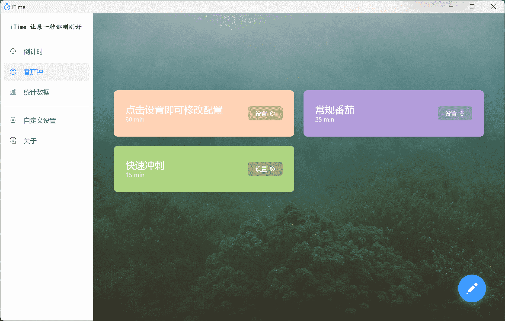
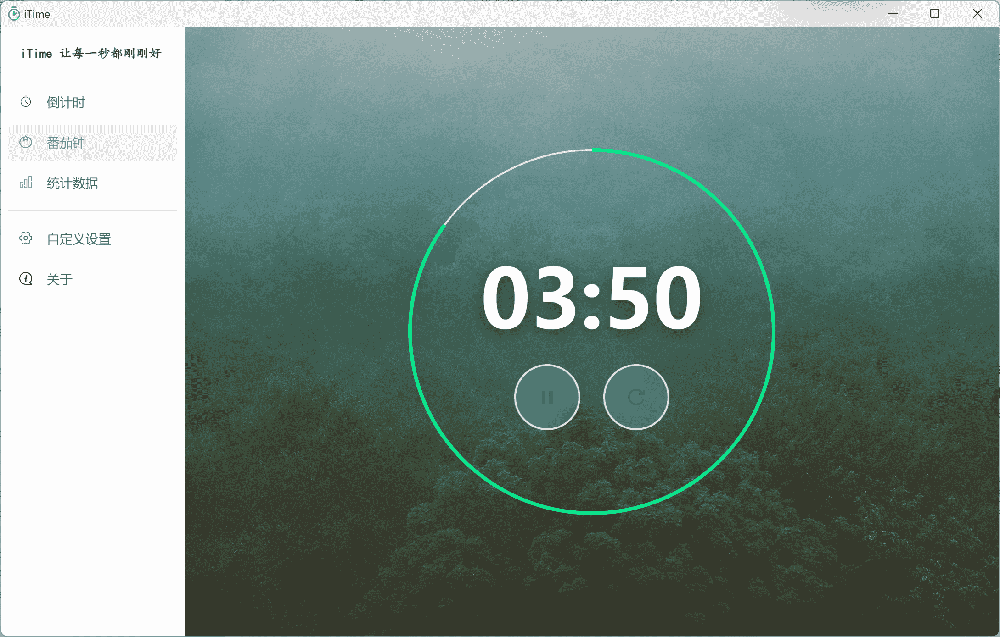
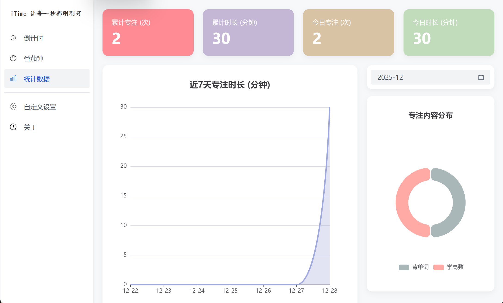

# iTime

## 原项目信息 📋

本项目是 [iTime](https://github.com/AZCodingAccount/iTime) 的 Fork 版本，原项目作者为 [AZCodingAccount](https://github.com/AZCodingAccount)。

本人在其基础上删改了部分功能，主要是添加了数据记录功能。

原仓库地址：
- Gitee：https://gitee.com/AZCodingAccount/iTime
- GitHub：https://github.com/AZCodingAccount/iTime

****

## 项目介绍 📘
**渐进式番茄钟**:





**数据统计**



## 快速开始 🚀

- **拉取项目** (您需要先安装 Git)

当前仓库
```bash
git clone https://github.com/the-bule-sea/iTime.git
```
或者是原作者仓库
```原仓库
# Gitee
git pull https://gitee.com/AZCodingAccount/iTime.git
# GitHub
git pull https://github.com/AZCodingAccount/iTime.git
```

- 运行项目

```bash
cd 拉取项目目录
pnpm i	    # 安装依赖
pnpm dev    # 运行vue程序
# 另外启动终端 
pnpm start	# 运行electron桌面程序
```

ℹ️ 在开发环境下，您需要设置相应的图片和语音路径，默认路径为生产环境下的

## 项目技术应用 🛠️

1. `Vue3`+`Electron`为主要开发技术
2. 采用`aro design`组件库并进行一定程度定制
3. 数据持久化采用`pinia`
4. 引入`quill`富文本编辑器
5. 第三方包
   1. `uuid`生成 TODO 随机 id
   2. `dayjs`格式化时间
   3. `electron-is-dev`判断开发或生产环境
   4. `electron-win-state`持久化窗口状态
   5. `pinia-plugin-persistedstate`持久化 pinia
   6. [`unplugin-vue-components`](https://github.com/antfu/unplugin-vue-components)+ [`unplugin-auto-import`](https://github.com/antfu/unplugin-auto-import) 按需引入组件
   7. [`echarts.js`](https://github.com/apache/echarts) 引入图表库
6. 打包使用`electron-builder`
